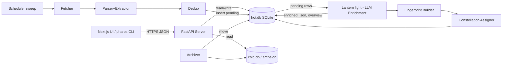

<p align="center">
  
</p>

# Pharos

> A beam through the noise.

**Pharos** is a self-hosted, open-source AI-enabled news aggregator. It pulls from
RSS/Atom/JSON feeds, enriches every article with an LLM into structured JSON
(MITRE Group / Software / Technique / Tactic IDs, CVEs, IOCs, summary,
key points), and clusters cross-source coverage of the same story using
deterministic keyword fingerprints — no vector DB, no Elasticsearch, no
heavy ML stack.

Storage is **SQLite only**: a hot DB for recent articles and a cold DB
("the archeion") for older content.

## Features

- **Curated default feeds** out of the box: CISA + national CERTs, security
  vendors (Microsoft, Mandiant, CrowdStrike, Talos, Unit 42, ...), news
  (BleepingComputer, Krebs, The Hacker News, ...), independent research
  (Project Zero, Citizen Lab, Schneier, ...), plus Twitter/X templates
  via Nitter/RSSHub. See [docs/DEFAULT_FEEDS.md](./docs/DEFAULT_FEEDS.md).
- Multi-user reader with per-user subscriptions, read/saved state, bookmarks,
  and saved searches ("watches").
- Modern, responsive SPA web UI (Vite + React + Tailwind) plus a JSON API.
- LLM-driven enrichment via OpenAI structured outputs.
- **First-class MITRE ATT&CK support** — Group IDs (G####), Software IDs (S####),
  Technique IDs (T####, T####.###), and Tactic IDs (TA####) are validated,
  indexed, weighted heavily for clustering, and rendered as deep links to
  attack.mitre.org. See [docs/MITRE.md](./docs/MITRE.md).
- **Constellations**: cross-source story clustering using weighted Jaccard
  over namespaced keyword tokens — fully deterministic and explainable
  (the UI shows you *which* tokens matched).
- Hot/cold SQLite split with FTS5 full-text search.
- Pluggable LLM backend behind a thin client (OpenAI by default; works with
  any OpenAI-compatible endpoint).
- Three deployment modes: all-in-one Docker, multi-container compose, or
  bare-metal systemd.

## Quickstart

### Option 1 — One-liner (Docker, fastest)

```bash
# Linux / macOS / WSL
curl -fsSL https://raw.githubusercontent.com/nullvaluefound/pharos/main/scripts/quickstart.sh | bash
```

```powershell
# Windows
iwr -useb https://raw.githubusercontent.com/nullvaluefound/pharos/main/scripts/quickstart.ps1 | iex
```

The one-liner clones the repo, generates a JWT secret, prompts for your
OpenAI key, builds the Docker stack, and prints a randomly-generated
admin password.

### Option 2 — Docker (interactive)

```bash
git clone https://github.com/nullvaluefound/pharos.git && cd pharos
./install.sh --docker          # or .\install.ps1 -Docker on Windows
```

A pre-flight container refuses to let the stack start if `.env` still
has placeholder secrets, so you can't accidentally boot with the
`sk-replace-me` key.

### Option 3 — Native dev (Python venv + npm)

```bash
git clone https://github.com/nullvaluefound/pharos.git && cd pharos
./install.sh --native --dev    # or .\install.ps1 -Native -Dev on Windows
source .venv/bin/activate
pharos sweep                                                  # ingestion (terminal 1)
pharos light                                                  # lantern   (terminal 2)
pharos notify                                                 # notifier  (terminal 3)
uvicorn pharos.api.app:create_app --factory --port 8000       # API       (terminal 4)
cd frontend && npm run dev                                    # UI        (terminal 5)
```

Open <http://localhost:3000>.

Full installation guide: **[docs/INSTALL.md](./docs/INSTALL.md)**.

## Architecture (one paragraph)

Three pipeline stages — **ingestion** (`pharos sweep`), **lantern**
(`pharos light`, the LLM enrichment engine), **archiver** (`pharos
archive`) — and a **FastAPI** serving layer. They communicate exclusively
through SQLite: ingestion inserts rows with `enrichment_status='pending'`,
the lantern picks them up, validates the LLM output against a strict
pydantic schema, normalizes entities into a structured table, builds a
namespaced keyword fingerprint, and uses an inverted index + weighted
Jaccard to assign the article to a "constellation". The archiver moves
old rows from `hot.db` to `cold.db` while keeping the structured JSON
forever. The API unions both databases through a `TEMP VIEW`.



Read more in [docs/ARCHITECTURE.md](./docs/ARCHITECTURE.md).

## Documentation

| Topic | |
|---|---|
| Installation | [docs/INSTALL.md](./docs/INSTALL.md) |
| Architecture | [docs/ARCHITECTURE.md](./docs/ARCHITECTURE.md) |
| Lantern (LLM + clustering) | [docs/LANTERN.md](./docs/LANTERN.md) |
| MITRE ATT&CK integration | [docs/MITRE.md](./docs/MITRE.md) |
| Configuration reference | [docs/CONFIGURATION.md](./docs/CONFIGURATION.md) |
| API reference | [docs/API.md](./docs/API.md) |
| Database schema | [docs/SCHEMA.md](./docs/SCHEMA.md) |
| CLI reference | [docs/CLI.md](./docs/CLI.md) |
| Deployment notes | [docs/DEPLOYMENT.md](./docs/DEPLOYMENT.md) |
| Development guide | [docs/DEVELOPMENT.md](./docs/DEVELOPMENT.md) |
| FAQ / design rationale | [docs/FAQ.md](./docs/FAQ.md) |

## CLI in 30 seconds

| Command | Purpose |
|---|---|
| `pharos init` | Create `hot.db` and `cold.db` with schema |
| `pharos adduser <name> [--admin]` | Create a local user |
| `pharos watch <feed-url> -u <name>` | Subscribe a user to a feed |
| `pharos catalog` | Show the bundled curated feed catalog |
| `pharos seed-feeds -u <name> -p starter` | Subscribe a user to a curated preset (starter / minimal / full / everything) |
| `pharos sweep` | Stage 1: ingestion scheduler |
| `pharos light` | Stage 2: the lantern (LLM enrichment) |
| `pharos archive` | Stage 3: archiver (hot -> cold), one-shot |
| `pharos status` | Pipeline status: counts by enrichment_status |
| `pharos feeds` | List all feeds + last-poll status |
| `pharos reprocess [--failed-only]` | Reset rows to pending |

Full reference: [docs/CLI.md](./docs/CLI.md).

## License

**Pharos is proprietary software.** Personal, self-hosted use by an
individual is permitted free of charge under the terms of the
[Pharos Proprietary License v1.0](./LICENSE).

**Any commercial, organizational, governmental, hosted, managed-service,
or third-party-facing use requires a separate commercial license.**
There is no automatic or click-through commercial grant — every
commercial license is issued case-by-case.

To request a commercial license, open a private inquiry on GitHub:
<https://github.com/nullvaluefound/pharos>

See [`LICENSE`](./LICENSE) for full terms, restrictions, and the
contributor grant.
