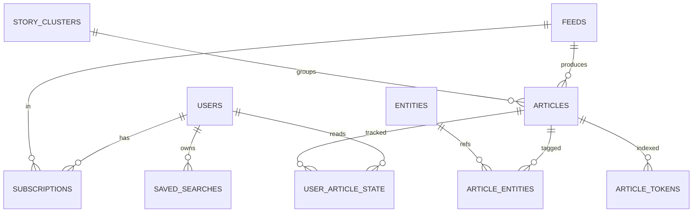

# Architecture

Pharos is a self-hosted, open-source AI-enabled news aggregator organized
as **three pipeline stages and one serving layer**, all communicating
through SQLite.

```text
                +-----------------------------+
                |  Clients (Next.js / CLI)    |
                +--------------+--------------+
                               | HTTPS JSON
                +--------------v--------------+
                |        FastAPI Server       |   <-- Serving Layer
                +--------------+--------------+
                               |
        +----------------------+----------------------+
        |                      |                      |
+-------v------+    +----------v---------+   +--------v---------+
|  Stage 1     |    |  Stage 2           |   |  Stage 3         |
|  Ingestion   |    |  Lantern (LLM)     |   |  Archiver        |
| (sweep)      |    |  (light)           |   |  (archive)       |
+-------+------+    +----------+---------+   +--------+---------+
        | INSERTs           ^  | UPDATEs              | MOVE
        v                   |  v                      v
        +------------------ SQLite -------------------+
        |  hot.db (WAL)         cold.db (archeion)    |
        +---------------------------------------------+
```

## Design principles

1. **Single-node first.** Everything runs on one machine on top of SQLite. No
   Kafka, no Redis, no vector DB, no Elasticsearch. You can scale horizontally
   later, but you don't have to.
2. **Pipeline stages talk through the database.** Stage 1 inserts rows with
   `enrichment_status='pending'`; Stage 2 picks them up. The handoff queue is
   literally a column. No external broker.
3. **Deterministic clustering.** The "constellation" feature (cross-source
   story grouping) uses weighted Jaccard over namespaced keyword tokens —
   fully explainable, fully reproducible. The LLM produces the tokens; the
   clusterer is pure SQL + arithmetic.
4. **Hot/cold split, no full-text loss.** Articles older than
   `ARCHIVE_AFTER_DAYS` move to `cold.db`; raw HTML is dropped, but the
   structured `enriched_json` is kept forever. A `UNION ALL` view makes the
   split invisible to read paths.
5. **LLM as enricher, not as searcher.** We never call the LLM at query time.
   The LLM runs once per article during enrichment to produce a strict JSON
   document; everything afterwards is normal SQL.

## The three stages

### Stage 1 — Ingestion (`pharos sweep`)

Modules: [`pharos.ingestion`](../backend/pharos/ingestion/)

- `scheduler.py` runs an `AsyncIOScheduler` with one job per feed at its
  `poll_interval_sec`.
- `fetcher.py` does HTTP GET with conditional headers (`If-None-Match`,
  `If-Modified-Since`) to avoid re-downloading unchanged feeds.
- `parser.py` dispatches RSS / Atom / JSON Feed through `feedparser`
  into a canonical `ParsedFeed`.
- `extractor.py` pulls the clean readable body out of HTML using
  `trafilatura`, with a regex fallback.
- `dedup.py` canonicalizes URLs (drops `utm_*`, normalizes scheme/host)
  and computes a 64-bit SimHash of the body.
- New articles are INSERTed with `enrichment_status='pending'`. That is
  the entire handoff to Stage 2.

### Stage 2 — Lantern (`pharos light`)

Modules: [`pharos.lantern`](../backend/pharos/lantern/)

- `worker.py` claims a batch of pending rows in a single
  `BEGIN IMMEDIATE` transaction (flipping them to `in_progress` so other
  workers don't pick them up).
- `llm_client.py` calls the OpenAI Chat Completions API with
  `response_format={"type":"json_schema", ...}`, forcing the model to
  emit a structurally valid `EnrichedArticle` document.
- `schema.py` defines `EnrichedArticle` (pydantic) with **MITRE ATT&CK
  identifiers as first-class fields** — Group IDs (G####), Software IDs
  (S####), Technique IDs (T####, T####.###), Tactic IDs (TA####).
  See [MITRE.md](./MITRE.md).
- The validated output is persisted: `enriched_json`, `overview`,
  `language`, `severity_hint`, plus normalized `entities` rows for fast
  filtering, plus an `articles_fts` (FTS5) row for text search.
- `fingerprint.py` builds a list of namespaced tokens from the entities
  (e.g. `mtg:g0016`, `cve:cve-2024-12345`, `ttp:t1566.001`, `w:phishing`).
- `constellations.py` looks up candidate articles via the
  `article_tokens` inverted index, scores them with weighted Jaccard,
  and either attaches the new article to an existing constellation or
  starts a new one.

See [LANTERN.md](./LANTERN.md) for the full algorithm and tuning knobs.

### Stage 3 — Archiver (`pharos archive`)

Module: [`pharos.archiver.job`](../backend/pharos/archiver/job.py)

Once per day (or on demand), the archiver moves articles older than
`ARCHIVE_AFTER_DAYS` from `hot.db` into `cold.db`:

- The `enriched_json`, `overview`, `entities`, and `tokens` are copied
  intact.
- `raw_text` and `raw_html_path` are dropped — we keep the structured
  knowledge, not the raw bytes.
- Per-user state (`user_article_state`) stays in `hot.db` and continues
  to reference the article ID (which is preserved across the move).

The API never has to know which database holds an article: it queries
the `all_articles` `TEMP VIEW` that unions hot + cold, so search,
stream, and `/related` endpoints work uniformly across both.

## Serving layer (`pharos.api`)

A FastAPI app with JWT-cookie auth. Routes:

- `auth` — login, register (gated), logout, `me`.
- `feeds` — subscriptions (per user).
- `stream` — paginated stream, `view=grouped|flat`.
- `articles` — detail, related (constellation siblings with
  `shared_tokens`), per-user read/saved state.
- `search` — structured filter JSON (`any_of`, `all_of`, `none_of`,
  `text`, `since_days`, `feed_ids`).
- `bookmarks` — saved articles.
- `watches` — saved searches (named filters).
- `admin` — pipeline status, reprocess, manual archive trigger.

Full reference in [API.md](./API.md).

## Data model



See [SCHEMA.md](./SCHEMA.md) for the full DDL with column-level
documentation.

## Why this is enough

A typical at-scale news-aggregator architecture (Cassandra + Elasticsearch
+ ML pipeline + vector DB + Kafka) makes sense at hundreds of millions of
users. For an individual or a small team, you can collapse all of that
into:

- One DB engine (SQLite) — `cp hot.db backup/` is your backup story.
- FTS5 for full-text search.
- Normalized entity tables for fast structured filtering.
- LLM enrichment for what used to be NLP / ML.
- Deterministic keyword Jaccard for what used to be embeddings.

If you ever want semantic similarity, drop in
[`sqlite-vec`](https://github.com/asg017/sqlite-vec) — still no new
data store. See [FAQ.md](./FAQ.md).
